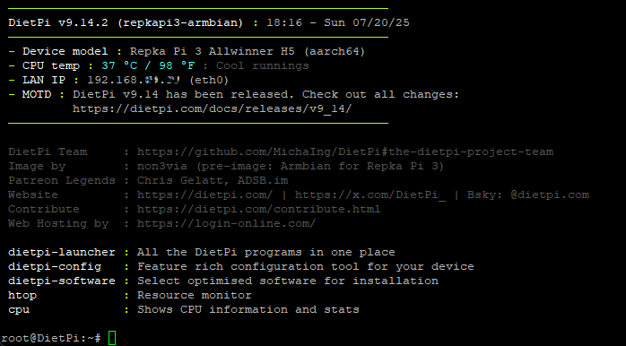

# Armbian-build для самостоятельной сборки Linux для Repka Pi 3

Armbian-build представляет собой фреймворк автоматизирующий компиляцию и сборку образов ОС Linux для различных платформ. Главная задача, которую решает данный репозиторий - получение опыта самостоятельной сборки в условиях ограниченного времени. Попутно решена задача сокращения числа ручных операций для сборки образа.

В репозитории присутствуют все необходимые патчи ядра, тщательно собранные на просторах интернета, в том числе на форуме и страницах авторов, которым уже удавалось собрать `Armbian` для `Repka Pi 3`, за что им огромное спасибо. Некоторые патчи сгенерированы заново, в связи с невозможностью точно определить первоисточник исходных файлов ОС, взятых за основу при изготовлении оригинальных патчей.

Предназначается энтузиастам, которым необходимо протестировать свои собственные патчи и/или собрать более свежую `DietPi` без потери `DTB`.

Дополнения и исправления приветствуются.

## Для сборки образа клонировать репозиторий

```bash
git clone https://github.com/non3via/armbian-build.git && cd ./armbian-build
```

## Собрать Armbian (minimal, legacy)

```bash
./compile.sh build BOARD=repkapi3 BRANCH=legacy BUILD_DESKTOP=no BUILD_MINIMAL=yes KERNEL_CONFIGURE=yes RELEASE=bookworm NAMESERVER=9.9.9.9
```

## Залить образ на флэш-карту, запустить, настроить сеть, зайти под root

```bash
sudo dd if=output/images/RepkaPi_25.05.0-trunk_Repkapi3_bookworm_legacy_6.1.104_minimal.img of=/dev/mmcblk0 bs=1M status=progress iflag=direct oflag=direct
```

## Установить DietPi

```bash
bash -c "$(curl -sSfL 'https://raw.githubusercontent.com/non3via/DietPi/repkapi3-armbian/.build/images/dietpi-installer')"
```

## Перезапустить и завершить настройку DietPi

```bash
reboot
```

## Результат успешной настройки

